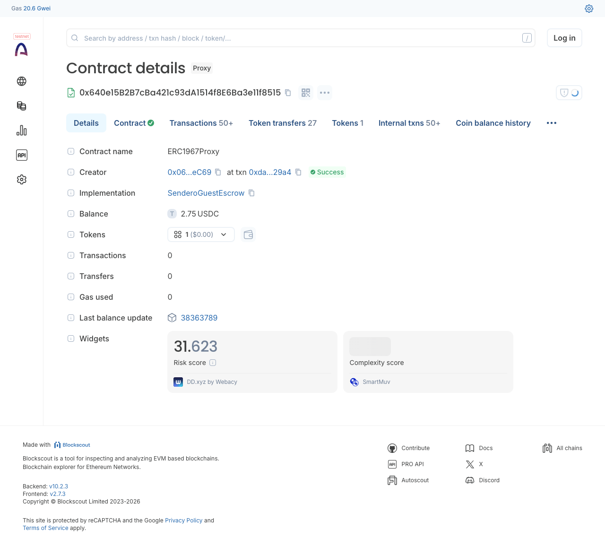
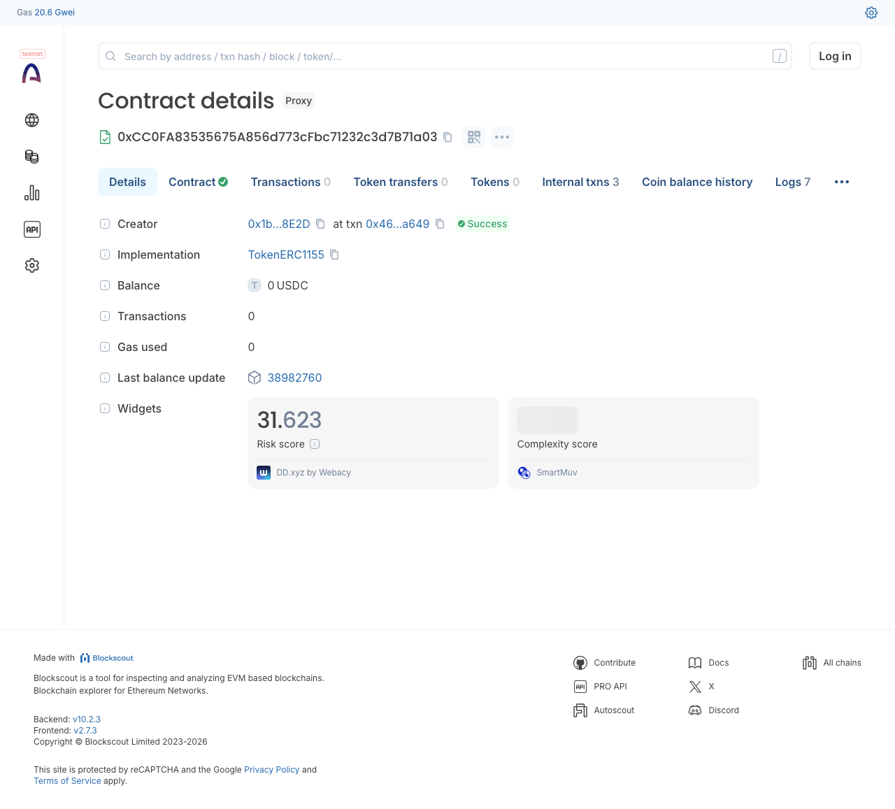
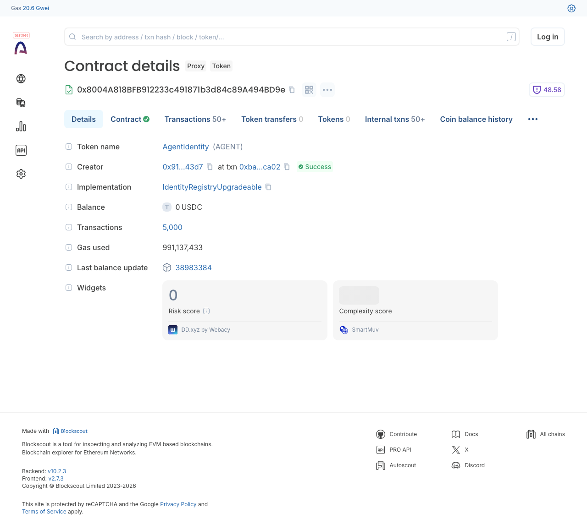
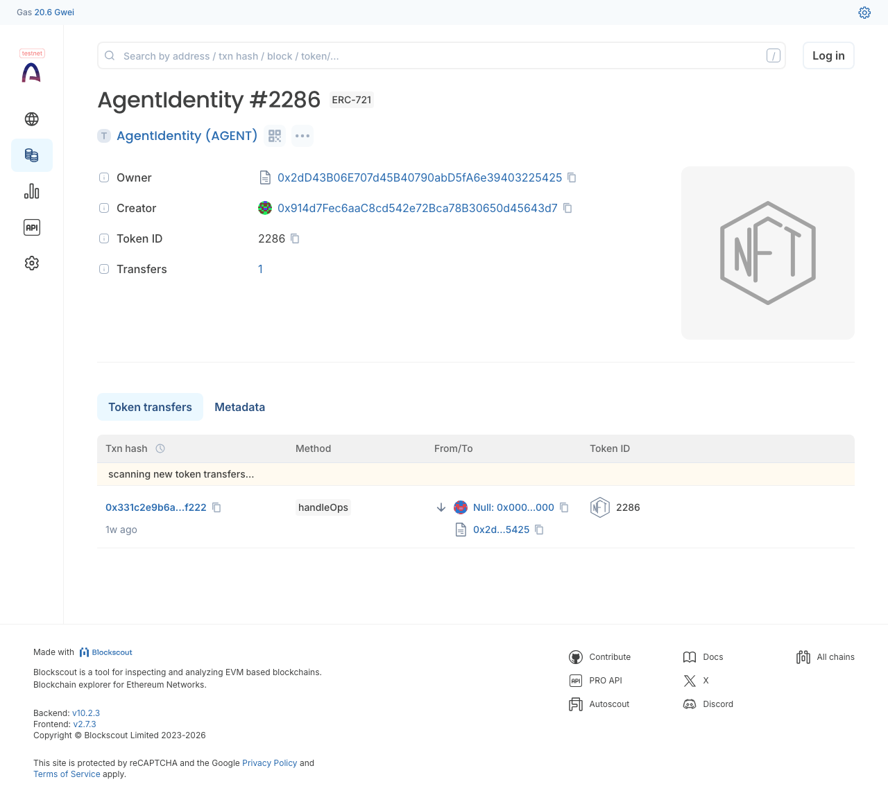
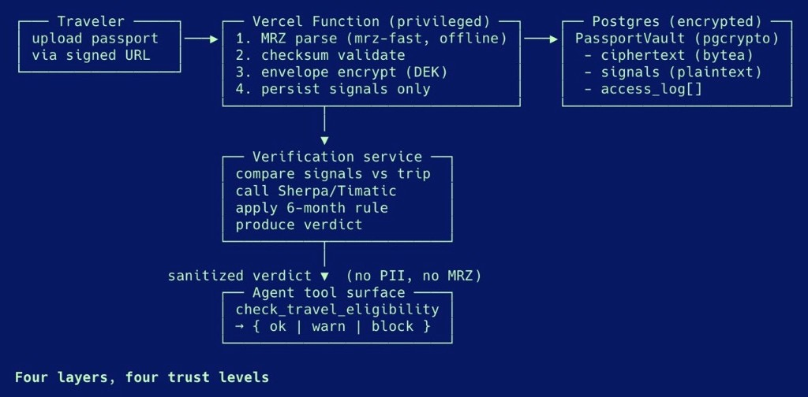
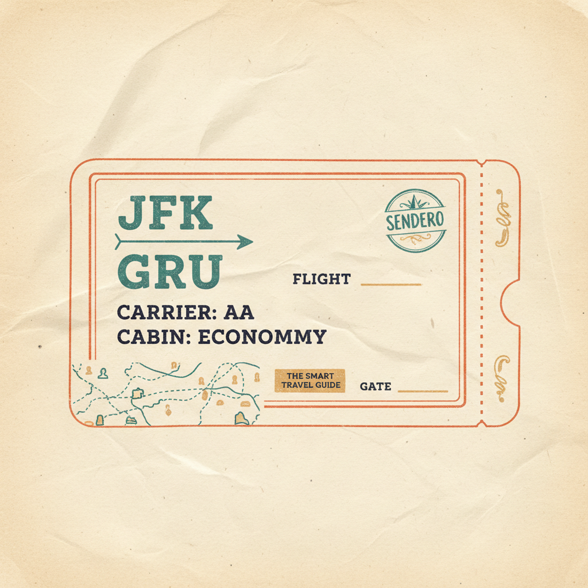
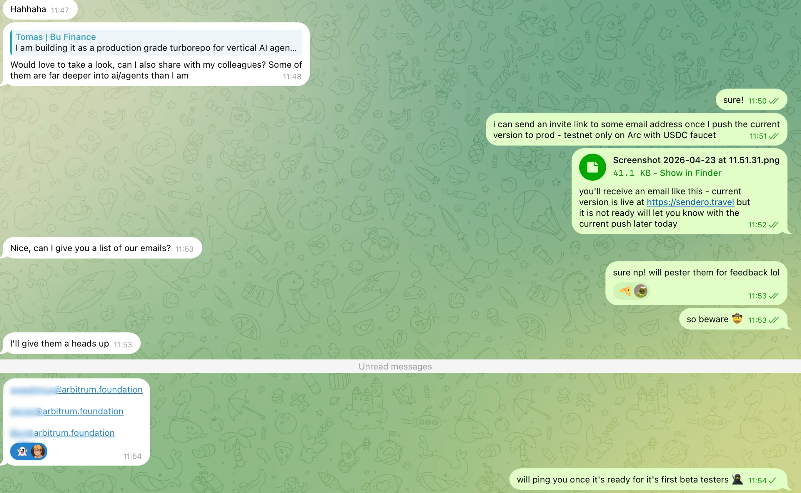

<p align="center">
  <strong>Hackathon submission</strong> — <em>Agentic Economy on Arc</em><br />
  <sub>Competition track · <a href="https://www.arc.network/">Arc</a> agent-native commerce and settlement</sub>
</p>

<div align="center">
  <a href="https://sendero.travel" title="Sendero">
    
  </a>
  <p>
    <strong>Vertical AI for travel operations</strong><br />
    <sub>Wallet- and agent-ready travel ops on <a href="https://www.arc.network/">Arc</a> · USDC / EURC settlement · MCP + <a href="#llms-txt-surfaces">llms.txt</a></sub>
  </p>
</div>

<br />

## For judges

**Judges:** Ping me for an invite to the app if you want to try Sendero while evaluating this submission. After you are added, you should receive a beta access email like the one below.

<p align="center">
  
</p>

<br />

## Verified on-chain — every Sendero contract is auditable on Arcscan

Every contract Sendero deploys to Arc-Testnet is verified on Arcscan (Blockscout). Run `bun scripts/verify-deployments.ts` to audit all six in one shot — exits 1 on any real gap so CI can wire it as a post-deploy guard. Latest live audit:

```
✅  SenderoGuestEscrow proxy        0x640e15B2…f8515  ERC1967Proxy → SenderoGuestEscrow
✅  SenderoStamps proxy             0xcc0fa835…71a03  EIP-1167 minimal proxy → TokenERC1155
✅  SenderoStamps impl              0xCCf28A44…D4672  TokenERC1155 (thirdweb pre-audited)
✅  ERC-8004 IdentityRegistry       0x8004A818…4BD9e  ERC1967Proxy → IdentityRegistryUpgradeable
✅  ERC-8004 ReputationRegistry     0x8004B663…88713  ERC1967Proxy
✅  ERC-8004 ValidationRegistry     0x8004Cb1B…B4272  ERC1967Proxy

🎉 All contracts verified-equivalent. Ship it.
```

<table>
  <tr>
    <td width="50%">
      <a href="https://testnet.arcscan.app/address/0x640e15B2B7cBa421c93dA1514f8E6Ba3e11f8515" target="_blank" rel="noreferrer">
        
      </a>
      <p align="center"><strong><a href="https://testnet.arcscan.app/address/0x640e15B2B7cBa421c93dA1514f8E6Ba3e11f8515">SenderoGuestEscrow proxy</a></strong> — guest-escrow + claim-link contract powering the Peanut-style trip funding flow. Source verified, implementation linked.</p>
    </td>
    <td width="50%">
      <a href="https://testnet.arcscan.app/address/0xcc0fa83535675a856d773cfbc71232c3d7b71a03" target="_blank" rel="noreferrer">
        
      </a>
      <p align="center"><strong><a href="https://testnet.arcscan.app/address/0xcc0fa83535675a856d773cfbc71232c3d7b71a03">SenderoStamps proxy</a></strong> — ERC-1155 collection where every NFT trip stamp lives. EIP-1167 minimal clone of the verified <code>TokenERC1155</code> impl; Arcscan auto-links them.</p>
    </td>
  </tr>
  <tr>
    <td width="50%">
      <a href="https://testnet.arcscan.app/address/0x8004A818BFB912233c491871b3d84c89A494BD9e" target="_blank" rel="noreferrer">
        
      </a>
      <p align="center"><strong><a href="https://testnet.arcscan.app/address/0x8004A818BFB912233c491871b3d84c89A494BD9e">ERC-8004 IdentityRegistry</a></strong> — the on-chain agent registry where every Sendero org and traveler gets a per-subject identity NFT. Mints atomically with wallet provisioning per the dual-reputation plan.</p>
    </td>
    <td width="50%">
      <a href="https://testnet.arcscan.app/token/0x8004A818BFB912233c491871b3d84c89A494BD9e/instance/2286" target="_blank" rel="noreferrer">
        
      </a>
      <p align="center"><strong><a href="https://testnet.arcscan.app/token/0x8004A818BFB912233c491871b3d84c89A494BD9e/instance/2286">Sendero agent NFT #2286</a></strong> — the platform's own ERC-8004 identity, minted via the bootstrap script. Future mints (org + user identities) render real Sendero brand art via <a href="./apps/app/app/agents/[kind]/[id]/metadata.json/route.ts"><code>/agents/[kind]/[id]/metadata.json</code></a>.</p>
    </td>
  </tr>
</table>

The `Proxy` badge + `Implementation` link in each screenshot is what proves the verification: Arcscan resolves the proxy bytecode, finds the impl, and surfaces the impl's full Solidity source on the proxy's "Read/Write Contract" tab. Three deployment shapes covered (full-source / EIP-1167 minimal proxy / ERC1967 upgradeable proxy), all encoded in [`scripts/verify-deployments.ts`](./scripts/verify-deployments.ts) so future deployments stay audited.

<br />

## Business model — production-grade SaaS + x402 nanopayments

Sendero monetizes on **two independent revenue legs** from day one. This is not a future plan — it is wired through Clerk Billing, `@sendero/billing`, and the agent dispatch path today.

**Leg 1 — Recurring SaaS (Clerk Billing on organizations).** Four plan tiers, monthly or annual, with a zero-card 14-day Pro trial. Plans gate capabilities (workspaces, production API keys, MCP-server exposure, SSO, white-label, SLA) via `has({ feature })`. Trial users get the full Pro ceiling at zero friction so they convert on what they actually shipped.

**Leg 2 — Per-call nanopayments (x402 on Arc, settled in USDC).** Every agent action — flight search, policy check, booking hold, confirmation, MCP tool call, AI-agent context — is priced in micro-USDC and metered through `MeterEvent`. The traveler's or buyer's Circle wallet settles in batches on Arc L2. This leg is consumption-based and runs in parallel to the subscription: SaaS customers still pay nanopayments, just at a discounted unit rate.

This is why the business model is durable: **the trial doesn't stop revenue, it shifts it.** A trialing user is still earning us nanopayment margin on every search and booking while they evaluate whether to pay for the SaaS shell. By the time Clerk flips the trial off, we've already shipped real trips against their wallet.

### Plan tiers (source of truth: [`packages/billing/src/plans.ts`](./packages/billing/src/plans.ts))

| | **Free** | **Basic** | **Pro** | **Enterprise** |
|---|---|---|---|---|
| **Monthly** | $0 | $19/mo | $60/mo | Custom *(list $1,500/mo)* |
| **Annual** | — | $15/mo *billed $180/yr* | $50/mo *billed $600/yr* | Custom *(list $1,250/mo · $15k/yr)* |
| **Workspaces** | 1 | 5 | Unlimited | Unlimited |
| **Production API keys** | 0 *(sandbox only)* | 3 | 25 | Unlimited |
| **Monthly spend cap ceiling** | $100 | $2,000 | $20,000 | Unlimited |
| **Nanopayment discount** | — | 15% off | 30% off | 50% off |
| **Booking take-rate discount** | — | 5% off | 10% off | 15% off |
| **WhatsApp + Slack channels** | — | ✓ | ✓ | ✓ |
| **Public MCP server** | — | — | ✓ | ✓ |
| **Custom webhooks + audit export** | — | — | ✓ | ✓ |
| **SSO/SAML + white-label + custom SLA** | — | — | — | ✓ |

### Why this shape

- **API keys on the scale axis, not the integration axis.** For an agent-native platform where x402 is the primary distribution channel, production keys are equivalent to seats on traditional SaaS. Gating them is the commercial ask.
- **Nanopayment discount scales with plan.** Paying MRR earns you unit economics. TMCs who would otherwise negotiate custom rates get default-priced terms — no bespoke contracts at Pro and below.
- **Zero-card trial on Pro, not Basic.** The trial should reveal the ceiling (public MCP, custom webhooks, audit export), not a throttled middle. Clerk's Oct-2025 no-card trials make this frictionless.
- **Annual = 15–21% off with clean monthly-equivalent numbers.** Clerk's annual field is actually the *monthly rate when billed annually* (validated as ≤ monthly). $15 and $50 present cleaner than the exact 2-months-free computed values and still deliver real savings.
- **Enterprise is an upward-open quote.** No list price, highest discount tier in code (50% / 15%), full capability set. Negotiation happens in the SLA, not in the feature checkbox matrix.

### Why this signals a durable vertical AI + SaaS business

Vertical AI agents that only charge per-call have thin defensibility — the next cheaper LLM or router eats your margin. Vertical AI agents that only charge SaaS miss the obvious x402 opportunity sitting on the same agent runtime. Sendero does both, in one workspace, on one codebase, from day one:

- **SaaS pays for the platform** (workspaces, channels, MCP, identity, audit).
- **Nanopayments pay for the calls** (every search, every booking, every settlement, every tool exposed to other agents).

Trials monetize leg 2 even when leg 1 is $0. Pro+ customers monetize both. Enterprise customers monetize both at committed discounts. The Clerk subscription keeps the customer; the Arc settlement keeps the network. Neither is the whole business — both together are.

<br />

## Best Use of Gemini — OCR for receivables

**Submission for the Google DeepMind Gemini prize category.** Drag a receipt, invoice, or boarding pass into [`/dashboard/scan`](./apps/app/app/(app)/dashboard/scan/page.tsx) and get sub-second structured extraction — field-accurate, schema-pinned, ready to reconcile against a trip.

**Why it matters.** Every travel booking generates receipts, invoices, and boarding passes that someone has to type back into a ledger. Sendero's agents read them directly. A traveler WhatsApps a crumpled taxi receipt → amount + merchant + date flow into the expense row. An operator forwards a supplier invoice → vendor + total + due date reconcile against the booking. A boarding pass PDF comes in → PNR + seat + cabin cross-check Duffel.

**Zod schemas pin Gemini's output.** No free-form JSON parsing, no regex salvage, no LLM-as-JSON-coercer. Four document kinds — invoice, receipt, boarding pass, government ID — each own a schema ([`packages/sendero-ocr/src/schemas/`](./packages/sendero-ocr/src/schemas/)) and a prompt. The schema IS the contract.

**Vertex AI → AI Studio credential cascade.** The same code runs with Google Cloud ADC in production and a plain `GEMINI_API_KEY` in local dev. One path gracefully degrades to the other; neither forces a redeploy. See [`packages/sendero-ocr/src/providers/gemini-multimodal.ts`](./packages/sendero-ocr/src/providers/gemini-multimodal.ts).

**Flash by default, Pro on demand.** `gemini-2.5-flash` is 3–5× faster and ~10× cheaper than Pro with the same accuracy when the schema is tight. Callers pass `model: 'gemini-2.5-pro'` only when a document is genuinely ambiguous.

**Thinking budget stripped** because OCR isn't a reasoning task. `providerOptions.google.thinkingConfig.thinkingBudget = 0` cuts latency 40–60% and cost ~3× with zero accuracy impact — the schema pins the output space, there's nothing to "think" about.

**Golden-set eval harness.** Field-level accuracy + p50/p95 latency, tracked per kind over time. Drop `{slug}.pdf` + `{slug}.yml` into [`packages/sendero-ocr/evals/golden/{kind}/`](./packages/sendero-ocr/evals/) and run `bun run eval`:

```
RECEIPTS (12 docs)
  field score       56/60  93.3%   (3 fuzzy)
  p50 latency       620 ms
  p95 latency      1840 ms
```

**Production hardening the other pitches won't mention** — see [`packages/tools/src/scan-document.ts`](./packages/tools/src/scan-document.ts) and [`packages/sendero-ocr/src/extract.ts`](./packages/sendero-ocr/src/extract.ts):
- **SSRF guard** on the URL-fetch path — cloud-metadata endpoints refused, https-only, redirects re-checked.
- **20 MB payload cap + MIME allowlist** before a byte reaches Gemini.
- **PII audit signal** on boarding-pass scans (PNR + passport fragments get logged without blocking).
- **Compliance gate on government-ID scans** — refuses unless the tenant admin has explicitly flipped `allowSensitive`.
- **Post-Gemini normalization** — ISO-4217 currencies, ISO-8601 dates (EU/US/JP forms), European `1.234,56` → `1234.56`, root-domain stripping — so downstream reconciliation is deterministic.

**Two entry points, one engine.** Interactive UI at [`/dashboard/scan`](./apps/app/app/(app)/dashboard/scan/page.tsx) for humans. Agent-callable [`scan_document`](./packages/tools/src/scan-document.ts) MCP tool for LLMs and x402 runners. Both hit `extractDocument()` — the only difference is who's uploading. The tool is also wired into the inbox composer, the chat console, and the tiptap bubble so receipts attached to any conversation get auto-extracted before the agent replies.

### Private passport verification + visa as an ancillary revenue line

Passports are the most sensitive document the platform will ever touch. Visa friction is also one of the biggest trip-abandonment drivers for LATAM outbound travelers. Sendero's answer treats both at once: **a strict encryption boundary** (the raw document never leaves the privileged path, the LLM only sees enum-coded verdicts) **paired with a revenue layer** (visa + eTA applications become an in-booking ancillary, not a compliance tax).

<p align="center">
  
</p>

#### Four layers, four trust levels — the encryption side

**L1 — Intake** ([`POST /api/passport/upload`](./apps/app/app/api/passport/upload/route.ts)). The client parses the two MRZ lines with [`mrz-fast`](https://www.npmjs.com/package/mrz-fast) (zero-dep, ICAO 9303 TD3, offline) and hashes the image to SHA-256. **Image bytes are discarded before the network call** — the server never sees pixels on the happy path.

**L2 — Privileged extraction** ([`packages/sendero-vault/src/extract.ts`](./packages/sendero-vault/src/extract.ts)). A Vercel Node function checksum-validates the MRZ. Every per-field check digit *and* the composite check digit must pass — that's machine evidence of an honest extraction, no LLM round-trip needed to trust it. A compliance-gated [Vertex AI Zero Data Retention](https://ai.google.dev/gemini-api/docs/zdr) fallback stays available for unusual layouts; opt-in per tenant, audited per call, never the default.

**L3 — Encrypted vault** ([`packages/sendero-vault/src/passport.ts`](./packages/sendero-vault/src/passport.ts) + [`PassportVault` model](./packages/database/prisma/schema.prisma)). `pgcrypto` `pgp_sym_encrypt(..., 'cipher-algo=aes256')` via parameterized `$queryRaw`, per-tenant Data Encryption Key derived via HKDF-SHA256 from a Vercel-env Key Encryption Key. **The KEK lives outside Postgres** — a DB dump's blast radius is bounded. Full name, passport#, DOB, MRZ lines stay inside `ciphertext bytea`; only sanitized signals — `nationalityIso3`, `expiresOn`, `documentVariant`, `mrzChecksumValid` — surface as plaintext columns. Every access appends to `PassportVaultAccessLog` — tampering the log tampers the audit trail.

**L4 — Agent surface** ([`check_travel_eligibility`](./packages/tools/src/check-travel-eligibility.ts) tool + [`sendero.verify_travel_documents`](./packages/workflows/src/catalog.ts) workflow). Returns `{ status: 'ok' | 'warn' | 'block', reasons: VerdictReasonCode[], actions: VerdictActionId[] }` — enum codes only, never prose, never dates, never names. The UI decorates codes into human copy via a translation table the agent never touches. `book_flight` will refuse on a `block` verdict before we touch a supplier.

#### Three tiers of trust — so verification never halts a quote

The pipeline ([`packages/sendero-vault/src/verify.ts`](./packages/sendero-vault/src/verify.ts)) picks the highest-confidence tier it has:

- **T2 — Vault** (MRZ-validated, encrypted). Required for ticketing + visa submission.
- **T1 — Self-declared** ([`TravelerOnboardingCard`](./apps/app/components/traveler/traveler-onboarding-card.tsx) + [`packages/sendero-vault/src/declared.ts`](./packages/sendero-vault/src/declared.ts)). Traveler picks nationality + expiry month in 10 seconds. Stored on `user.metadata.travelerProfile` as ISO-3 + date — no PII, no encryption.
- **T0 — Tenant default** — admin sets `defaultNationalityIso3` once; new users get visa-aware quotes on day zero.

The upload gate fires only when a trip actually demands it: visa-required corridor, expiry within 12 months of return, trip total over the tenant ceiling, or tenant policy demands it. **Quotes, searches, and most domestic bookings never trigger it.**

#### Async + webhook-driven — so the user never waits

Eligibility runs are jobs, not synchronous calls ([`TripEligibilityRun` model](./packages/database/prisma/schema.prisma) + [`packages/sendero-vault/src/eligibility-run.ts`](./packages/sendero-vault/src/eligibility-run.ts)). The booking UI fires [`POST /api/trip-eligibility/start`](./apps/app/app/api/trip-eligibility/start/route.ts), gets a `runId`, and subscribes to [`/api/trip-eligibility/{runId}/stream`](./apps/app/app/api/trip-eligibility/[runId]/stream/route.ts) — a Server-Sent Events channel backed by Postgres `LISTEN/NOTIFY` on Neon's unpooled endpoint. Flight cards render *"checking visa requirements…"* and flip when `pg_notify` fires. An inbound [`/api/webhooks/sherpa`](./apps/app/app/api/webhooks/sherpa/route.ts) endpoint is stubbed + shared-secret validated for when Sherpa exposes eVisa state events.

#### Sherpa Requirements API v3 — production-grade visa data

[`@sendero/sherpa`](./packages/sendero-sherpa/) wraps [Sherpa's Requirements API v3](https://docs.joinsherpa.io/requirements-api/) against the vendored OpenAPI spec at [`packages/sendero-sherpa/openapi/sherpa-requirements-api-v3.json`](./packages/sendero-sherpa/openapi/sherpa-requirements-api-v3.json) — 2000+ government + travel-organization sources, IATA Open API standard, AES-256 at rest, SSL/TLS 1 transport. `POST /v3/trips` with JSON:API, UTM-attributed "See details" redirects. When `SHERPA_API_KEY` is set we overlay Sherpa's verdict on ours; when the call times out, rate-limits, or errors we degrade to the curated corridor table in [`packages/sendero-vault/src/visa-rules.ts`](./packages/sendero-vault/src/visa-rules.ts) — the caller never notices.

#### Visa as a revenue line — LATAM's biggest opportunity

When Sherpa returns an `apply-product` action for the traveler's nationality × destination, it carries a full `Product` shape — `productId` (e.g. `USA_ESTA`, `CAN_ETA`, `IND_EVISA`), price, breakdown (government fee + service fee), application deadline, co-branded apply URL. Sendero exposes it as an `ancillary` hint on the verdict, ready to surface as an **"Add visa assistance — $185" CTA on the flight-offer card**. Partners on Sherpa see [14.6% conversion on booking-confirmation pages, 31% higher average booking values, 100% lift in ancillary add-ons](https://www.joinsherpa.com/solutions). The LATAM outbound lane (BRA → USA, ARG → USA, MEX → CAN, COL → Schengen) is where visa friction historically caused the most trip abandonment — and where Sendero's Arc-settled booking cart turns that friction into attach revenue.

#### The PII boundary stays hard

Agents, workflow scratchpads, and log lines only ever see enum codes + non-PII `ancillary` fields. Full legal name, DOB, passport number, and MRZ lines stay in `ciphertext bytea` and surface at two controlled moments: when **the traveler** views [`/dashboard/passport`](./apps/app/app/api/passport/self/route.ts), and when **Duffel ticketing or Sherpa eVisa submission** calls [`readVaultTicketingRecord()`](./packages/sendero-vault/src/passport.ts) — which writes a separate `ticketing_read` audit-log action distinct from `decrypt`, so compliance can distinguish "booking read passport# for legitimate reasons" from "owner viewed their own document." The LLM is never on either side of that boundary.

#### What this buys in the demo

A new traveler signs in → dashboard shows the 10-second onboarding card → every flight search from that moment runs visa-aware, async via Sherpa in the background. **USA → CAN** business trip → verdict `ok` in under 400 ms, "visa-free" badge on the offer, one-tap book. **BRA → USA** 5-day business trip → verdict `warn` with `visa_required_not_on_file` + a Sherpa B2 eVisa `ancillary` hint → offer card sprouts *"Add B2 visa assistance — $185"*, tap adds it to the Arc-settled booking cart alongside the flight. WhatsApp a passport photo at any point → the agent refuses, logs the attempt, and replies *"passports go in the secure vault — here's a link"*. Upload, MRZ validates, vault encrypts. **Same rigor as on-chain escrow, applied to identity documents — and the same rigor applied to ancillary revenue.**

### Living NFT stamps — Gemini generates trip art across the journey

<p align="center">
  <a href="https://gateway.pinata.cloud/ipfs/bafybeihzltlavpdf3xoksvx4542gzki5if4cpzgfezcms22k3bbvuonedy" target="_blank" rel="noreferrer">
    
  </a>
</p>

> **Live artifact from this hackathon submission** — 1024×1024 PNG generated in **~7s** by Gemini 2.5 Flash Image via Vertex AI, captioned in **~1s** by Gemini 2.5 Flash-Lite, both pinned to IPFS via Pinata in **~6s** combined. **Total wall-clock ~14s** for a fully-shareable, on-chain-ready NFT artifact.
>
> - **Image on IPFS** (canonical, immutable): [`ipfs://bafybei…onedy`](https://gateway.pinata.cloud/ipfs/bafybeihzltlavpdf3xoksvx4542gzki5if4cpzgfezcms22k3bbvuonedy) · mirrors: [ipfs.io](https://ipfs.io/ipfs/bafybeihzltlavpdf3xoksvx4542gzki5if4cpzgfezcms22k3bbvuonedy) · [cloudflare-ipfs](https://cloudflare-ipfs.com/ipfs/bafybeihzltlavpdf3xoksvx4542gzki5if4cpzgfezcms22k3bbvuonedy)
> - **OpenSea-shape manifest** (the on-chain `tokenURI`): [`ipfs://bafkrei…sort4`](https://gateway.pinata.cloud/ipfs/bafkreig55n2lf4ktzj45ju6tit4z5wra4tuwifw76bfjynxsx5p7hsort4)
> - **GPT-/Gemini-written caption** baked into the manifest: *"Confirmed AA to GRU from JFK – the adventure officially begins!"*
> - **SenderoStamps ERC-1155 contract** (Circle SCP, deployed Apr 2026, all auto-verified by Circle's pipeline): Arcscan [`0xcc0f…1a03`](https://testnet.arcscan.app/address/0xcc0fa83535675a856d773cfbc71232c3d7b71a03) · Arc explorer [`0xcc0f…1a03`](https://testnet-explorer.arc.com/address/0xcc0fa83535675a856d773cfbc71232c3d7b71a03)
>
> **Why the art lives on IPFS, not Vercel Blob.** The OG unfurl path needs unauthenticated public HTTPS so Slackbot, WhatsApp, X, and Discord can fetch the image without a session cookie. Pinata's gateway gives us that for free; the on-chain `tokenURI` resolves to the same `ipfs://` CID through *any* IPFS gateway in the world, forever. Paste the manifest link into Slack and the boarding pass renders inline as the unfurl preview. Same `og:image` is set in `<head>` of [`/stamps/[tokenId]`](./apps/app/app/stamps/%5BtokenId%5D/page.tsx) for direct link previews.

The same Gemini stack that reads documents (OCR above) also **paints them**. Every time a Sendero trip crosses a meaningful state boundary, a Vercel Workflow fires Gemini 2.5 Flash Image and a GPT-5-nano caption *in parallel*, pins both to IPFS, and mints an ERC-1155 stamp into the traveler's Developer Controlled Wallet on Arc-Testnet. By trip end the user owns a small **collectible passport** — every stamp is a moment in the journey, the art is generated specifically for that trip, and the OpenGraph payload makes Slack and WhatsApp render the art when the link is shared. **Proof-of-trip you can put in your pocket.**

Pattern lifted directly from Vercel's [`birthday-card-generator`](https://github.com/vercel/workflow/tree/main/examples/birthday-card-generator) example — the *parallel art + text → durable upload → on-chain mint* shape generalizes beautifully from "card a friend can RSVP to" to "NFT a traveler keeps." Everything runs on Vercel Workflow DevKit; every step is `'use step'` so a transient Gemini 5xx, a Pinata timeout, or a redeploy doesn't burn tokens or re-mint on Arc.

#### Four kind-specific entrypoints — one for each beat in the trip

```
apps/app/workflows/stamps/
├── generate-boarding-pass.ts       ← BoardingPass
├── generate-settlement-receipt.ts  ← SettlementReceipt
├── generate-itinerary-map.ts       ← ItineraryMap
└── generate-trip-passport.ts       ← TripPassport
```

**🛫 BoardingPass** — fires the moment `confirm_flight` lands a Duffel order. Gemini draws a **vintage 1960s jet-age boarding pass** on cream cardstock — perforated edge, route codes typeset like jet-age letterpress, carrier and cabin baked into the prompt. Caption is GPT-5-nano in journal-entry voice: *"Gate B22, flight booked — JFK to GRU, the long way home."* Mints to the traveler's DCW the second the supplier confirms.

**🧾 SettlementReceipt** — fires on `settle_booking` after USDC moves on Arc. Gemini draws a **vintage railway-ticket receipt** with the actual amount stamped on it in the tenant's brand color, the Arc transaction hash baked into the punched cancellation marks. Caption is brisk, ledger-clerk voice: *"Paid in full, USDC 4,287.50 — booked, settled, ledger closed."* The art *is* the proof of payment.

**🗺️ ItineraryMap** — fires on `book_flight` and refreshes as legs are added (the contract supports `setTokenURI` so the same NFT updates in place). Gemini draws a **WPA-poster travel map** — flowing route line, stylized landmasses in tenant-brand `oklch()`, compass rose top-right, brand cartouche bottom-right. As more legs land, the map redraws without minting a new token — your *single* itinerary stamp deepens through the trip.

**📔 TripPassport** — fires on the **last** `settle_booking`, when the trip closes. Gemini draws a **two-page passport spread** with overlapping ink stamps for every tool the agent used during the trip — boarding passes, hotel chops, settlement receipts, itinerary map. The capstone NFT. For multi-traveler trips, the same class id is minted with `quantity = N` and distributed via the contract's group-mint extension — every traveler walks away with a copy of the same shared passport.

#### The technical magic that makes it actually work

```ts
// apps/app/workflows/stamps/generate-stamp.ts — the shared engine
'use workflow';

const ctx = await loadStampContext({ kind, tripId, bookingId });

// Parallel: Gemini paints, GPT-5-nano writes — saves ~2s per stamp.
const [imageDataUrl, caption] = await Promise.all([
  generateStampImage(imagePromptForKind(ctx)),    // 'use step'
  generateStampCaption(captionPromptForKind(ctx)) // 'use step'
]);

// Hot path (Vercel Blob) AND cold path (IPFS via Pinata).
const blobUrl    = await uploadStampToBlob(...);   // 'use step'
const imageCid   = await pinStampImageToIpfs(...); // 'use step'
const manifestCid = await pinStampManifestToIpfs({
  ...manifest,
  image:      `ipfs://${imageCid}`, // canonical
  image_blob: blobUrl,              // hot OG / dashboard
});

// Mint via the existing mint_stamp x402 tool — idempotent on (kind, primaryKey).
const { tokenId, txHash } = await execMintFirst({
  ctx,
  uri: `ipfs://${manifestCid}`,
  to:  ctx.travelers[0].address,
});
```

- **Parallel image + caption** — Gemini 2.5 Flash Image and GPT-5-nano hit the AI Gateway simultaneously. ~2 s saved per stamp.
- **Two homes for the art** — the canonical URI on-chain is `ipfs://<manifestCid>`, but the manifest also carries `image_blob: <Vercel Blob URL>` so the OG unfurl renders in <100 ms instead of waiting on an IPFS gateway. Best of both worlds: decentralized truth, centralized speed.
- **Idempotent everywhere** — Pinata is content-addressed (re-uploading identical bytes returns the same CID), the `mint_stamp` tool is `UNIQUE(kind, primaryKey)` in Postgres, the contract assigns sequential token ids. Re-run the workflow with the same `(tripId, bookingId)` → same CID, same row, same token id, no double-spend, no double-mint.
- **WDK retries are surgical** — Gemini 5xx? Just that step retries. Pinata 502? Just that step. Mint reverts? Image + manifest already pinned, the workflow re-attempts mint without re-spending Gemini tokens.
- **One on-chain tx, one URI, one event** — no placeholder URI, no second `setTokenURI` call, no extra event for indexers to special-case. Art-first, then mint.
- **Live progress stream** — every `'use step'` writes a JSON event onto the WDK readable. The dashboard StampCard subscribes via [`/api/workflows/stamps/runs/[runId]/stream`](./apps/app/app/api/workflows/stamps/runs/%5BrunId%5D/stream/route.ts) and replaces a shimmering passport-cover skeleton in real time as each step completes.

#### Why the OG unfurl is a feature, not an afterthought

The public stamp page at [`/stamps/[tokenId]`](./apps/app/app/stamps/%5BtokenId%5D/page.tsx) lives outside the auth-gated `(app)` segment so Slackbot, WhatsApp, and X can fetch it without a session. `generateMetadata` returns `og:image` (the hot Vercel Blob URL — not IPFS, because unfurl bots have a ~3 s budget), `twitter:summary_large_image`, and `eth:nft:contract` / `eth:nft:token_id` / `eth:nft:chain` hints for NFT-aware bots. **Paste a stamp link in any chat → the art renders inline.** Recipients see the trip, click through, discover Sendero. The collectible *is* the marketing surface.

#### The return-for-service loop

Signed-in travelers see their full collection at [`/dashboard/stamps`](./apps/app/app/(app)/dashboard/stamps/page.tsx) — a 4-column responsive grid backed by [`NftStampOwnership`](./packages/database/prisma/schema.prisma). The Postgres table is populated by **Circle Event Monitors** (registered via [`scripts/register-stamps-event-monitor.ts`](./scripts/register-stamps-event-monitor.ts) — `TransferSingle` / `TransferBatch` / `TokensMinted` / `URI`) hitting [`/api/webhooks/circle/events`](./apps/app/app/api/webhooks/circle/events/route.ts), which means **no separate indexer to operate** — Circle's infra is the source of truth, our webhook is just a thin reducer. A future iteration adds *"re-book this route"* CTAs hovered off each stamp's `attributes` so the collection literally drives repeat travel — every stamp is a return-for-service hook.

#### Why this stack, not another one

- **Gemini 2.5 Flash Image** — handles the four distinct prompt aesthetics (boarding-pass, railway-receipt, WPA-poster, passport-spread) with one model. No prompt-juggling across providers.
- **Vercel Workflow DevKit** — `'use workflow'` + `'use step'` is the cleanest way we've seen to express "one durable graph spanning Gemini, Pinata, Postgres, and an EVM RPC." Birthday-card-generator was the proof; we just generalized the shape.
- **Pinata for IPFS** — content-addressed pinning makes retries free. JSON + image upload from the same SDK.
- **Circle Smart Contract Platform** — pre-audited ERC-1155 template, automatic Gas Station sponsorship — the treasury wallet signs `mintTo(...)` and Circle bills Sendero in fiat. Travelers never see gas.
- **Vercel Blob** — the hot path for OG previews + dashboard cards. IPFS is the canonical truth; Blob is the speed.

**End-to-end, in numbers.** ~6 s wall-clock from the supplier confirming a flight to a minted NFT in the traveler's wallet. ~$0.0003 of Pinata storage per stamp. Zero gas to the user. Zero ops surface to maintain — Circle's Event Monitors keep our Postgres in sync without a Ponder node, an Etherscan subscription, or a cron job.

> The pitch in one line: Gemini paints a vintage travel artifact for every meaningful moment of your trip, Vercel Workflows guarantees the pipeline is durable + idempotent, Circle handles the on-chain mint without gas friction, and the OG unfurl turns every stamp into a marketing surface that actually moves bookings. **NFT mania of 2020, redone in the age of agentic AI — but this time the artwork has a job.**

## Developer experience — the docs surface we wanted when we started

Sherpa's docs set the B2B API bar: top-nav API access, Postman import, "Trips LLM Friendly" endpoint. We matched it and closed two gaps they don't — **self-service key issuance** (they gate behind a form; we Clerk-native it) and **per-page markdown exports** for every docs page (they have one LLM endpoint; we automate the pattern across the whole tree).

- **Canonical OpenAPI 3.1** at [`/api/openapi.json`](https://www.sendero.travel/api/openapi.json), generated from the tool registry in [`packages/tools/src/openapi.ts`](./packages/tools/src/openapi.ts). Scalar, Redoc, Postman, Insomnia consume it as-is. **Can't drift from code** — there's no hand-maintained spec.
- **Interactive Scalar viewer** at [`/api-viewer`](./apps/docs/app/api-viewer/page.tsx). Try any tool, copy the `curl`, deep-link to Clerk's API-key UI.
- **Docs-as-markdown for agents** — append `.md` to any `/docs/*` URL. Route at [`apps/docs/app/docs/[[...slug]].md/route.ts`](./apps/docs/app/docs/%5B%5B...slug%5D%5D.md/route.ts). Single pattern, every page.
- **Top-nav CTA** in [`apps/docs/app/docs/layout.tsx`](./apps/docs/app/docs/layout.tsx): API Reference → MCP → Get API key. The last link goes straight to [`/dashboard/settings/api-keys`](./apps/app/app/(app)/dashboard/settings/api-keys) — Clerk-native, one click, no form.
- **llms.txt surfaces it all** — [`packages/llms/src/catalog.ts`](./packages/llms/src/catalog.ts) advertises the OpenAPI URL, the Scalar viewer, the per-page `.md` pattern, and the self-serve key path. An agent crawling our site discovers every surface in one fetch.

**Time-to-first-success** (per the `developer-experience` skill's north star): sign up → mint key → first nanopayment-billed tool call in under 5 minutes, no sales call, no email thread.

## Hardening the x402 edge — scoped keys, signed requests, signed envelopes

x402 monetizes every leaked key adversarially. A stolen bearer that fires 10 000 cheap searches before we revoke is still real money; a stolen bearer that moves USDC is catastrophic. Sendero's answer is **defence in depth without latency tax** — three controls, each small, each ships in isolation, none add cost to the hot path.

See [`/docs/security`](./apps/docs/content/docs/security.mdx) for the full integration recipe.

**1. Scoped API keys** ([`packages/auth/src/dispatch-auth.ts`](./packages/auth/src/dispatch-auth.ts), [`apps/app/lib/dispatch-scopes.ts`](./apps/app/lib/dispatch-scopes.ts)). Every key carries a scope set: `search`, `bookings`, `settlement`, `treasury`, `documents`, `compliance`, `trip_assistance`, `utilities`, or `*`. Sandbox keys default to `*`; production keys mint with a read-mostly default (`search + trip_assistance + utilities + compliance + documents`) — **no settlement, no treasury**. Tenant admins promote keys via `tenant.metadata.apiKeyScopes[keyId]`. The dispatch route **filters the tool registry before the LLM sees it** (`filterToolsByScopes`), so prompt injection can't sneak the model into calling a tool outside scope.

**2. HMAC-signed requests — privileged tools only** ([`apps/app/lib/dispatch-signing.ts`](./apps/app/lib/dispatch-signing.ts)). Keys with `settlement`, `treasury`, or `*` must sign with `x-sendero-ts` + `x-sendero-nonce` + `x-sendero-sig = HMAC-SHA256(sha256(bearer), canonical-string)`. Read-mostly scopes stay bearer-only so the hot path keeps its sub-second latency budget. **Nonce dedup via Upstash `SET NX EX 120s`** catches replays inside the 60s signature window. The bearer itself is the shared secret — no separate key distribution, no rotation dance.

**3. Signed response envelopes — every reply** ([`buildResponseHeaders()`](./packages/auth/src/dispatch-auth.ts) + [`dispatch/route.ts`](./apps/app/app/api/agent/dispatch/route.ts)). Every response carries `x-sendero-trace-id`, `x-sendero-meter-id`, `x-sendero-ts`, `x-sendero-sig` signing the exact response bytes + the meter-event id that billed. Customers verify on reception → MITM replays of cached responses are exposed as unpaid. The trace id is what support tickets quote; it keys our audit log.

**The result**: a compromised search key spams free-tier search but cannot move USDC or touch passport PII. A settlement key is useless without the ability to sign with the bearer (which the attacker would need too — at which point signing doesn't matter, but also nothing else does). A response can't be cached-and-replayed as paid. And the hot path stays at **Clerk-verify-cached → scope-check → tool-call — no extra round trips**.

| Path | Auth | Cost over bearer |
| --- | --- | --- |
| Discovery (`/api/openapi.json`, `/llms.txt`, `/docs/*`) | None | — |
| Hot path (`search`, `compliance`, `trip_assistance`, `utilities`) | Bearer + scope check | ~0 (in-process) |
| Privileged (`settlement`, `treasury`, `*`) | Bearer + HMAC + nonce | ~200µs sig verify + one Redis `SETNX` |
| All dispatch responses | — | Trace id + HMAC sign ~50µs |

<br />

## Production-grade workflow runtime — Vercel Workflows + Fluid Compute

> By default, Vercel Workflows encrypts all data, including step inputs, outputs, and stream chunks, before they leave your deployment. Nothing is readable in transit or at rest outside your environment, and decryption only happens inside the deployment running the workflow.
> — [Vercel Workflows](https://vercel.com/docs/workflows)

Sendero's agent layer is a workflow engine first and a chat surface second. That choice has runtime consequences — long-running booking flows that wait days for a supplier webhook, OCR pipelines that move multi-MB passport scans through privileged extraction, settlement runs that fan one userOp out into seven on-chain transfers, multi-step setup wizards that pause overnight while a tenant admin grants Slack scopes. None of that is safe on cold-start serverless or on vanilla edge functions. **Vercel Workflows on Fluid Compute** gives us four guarantees we'd otherwise have to rebuild ourselves:

**1. Encrypted by default.** Step inputs, outputs, and stream chunks are encrypted before they leave the deployment. Passport MRZ extractions, settlement memos, OCR'd boarding-pass JSON, traveler emails, Slack OAuth state payloads — none of it is readable in transit or at rest outside the Sendero deployment. Pairs cleanly with our column-level [`PassportVault`](./packages/sendero-vault/src/passport.ts) AES-256 encryption (`pgcrypto`, per-tenant DEK derived via HKDF from a Vercel-env KEK): **Workflows handles transport, `pgcrypto` handles storage** — the LLM never sees a plaintext on either side.

**2. Durable execution.** [`packages/workflows`](./packages/workflows) defines the graphs (`sendero.book_flight`, `cancellationRecoveryWorkflow`, `agencyCohortWorkflow`, channel setup wizards), and the [`WorkflowRun`](./packages/database/prisma/schema.prisma) row is the resumable checkpoint — but the runtime that survives crashes, cold starts, and redeploys is Workflows + Fluid Compute. `sendero.book_flight` can pause for hours awaiting `supplier_order_ticketed`, drift across two deploys, and resume from the exact pending step on the next webhook. The traveler reaches out on WhatsApp on Monday, the supplier confirms ticketing on Wednesday, the same workflow run mails the receipt — one durable object, three timezones, zero glue code.

**3. Resumable streams + large-payload headroom.** Agent turns that emit live tool-output streaming, OCR jobs that pass entire PDF buffers, flight searches that return hundreds of offers — Fluid Compute's graceful-shutdown + request-cancellation semantics combined with Workflows' resumable streams mean we can move multi-MB payloads through hours-long state machines without a custom queue. The SSE channel at [`/api/wallet/balance/stream`](./apps/app/app/api/wallet/balance/stream/route.ts) and the eligibility-run channel at [`/api/trip-eligibility/[runId]/stream`](./apps/app/app/api/trip-eligibility/%5BrunId%5D/stream/route.ts) both lean on this — the EventSource can drop, the workflow keeps running, the next reconnect picks up mid-stream.

**4. AI SDK ↔ Workflow SDK integration — agents *are* workflows.** Tools can be implemented as workflow steps (automatic retries, deterministic replay across resumes) or as regular workflow-level logic that uses `sleep` and hooks to suspend on webhooks. [`runAgentTurn`](./packages/agent) orchestrates the AI SDK's tool-calling loop *inside* a Workflows run — every tool invocation is a checkpointable step, every supplier webhook is a hook, every meter event is a step output the runtime can replay. LLM crashes mid-turn → workflow resumes from the last completed tool call. Duffel API times out → the step retries with backoff. 24-hour ticketing wait → the workflow sleeps without burning compute. The agent processes tool calls iteratively until completion, surviving its own restarts and the supplier's failures along the way.

**Fluid Compute is the right primitive for AI agents.** Not Edge Functions — incompatible Node bindings, memory ceiling, no Prisma adapter on most ORMs. Not classic serverless — cold-start tax, one-request-per-instance billing, no concurrency reuse. Fluid Compute reuses function instances across concurrent requests (significantly fewer cold starts), gives us full Node.js + Bun + Rust runtimes natively, defaults to a 300s timeout, supports graceful shutdown + request cancellation, and prices on Active CPU rather than wall-clock GB-seconds. For an agent layer that *must* hold state across multi-minute LLM calls + supplier waits + on-chain settlement, that's the difference between "this works in a demo" and "this works at production scale."

This is the runtime contract that makes the rest of the README possible. The Arc escrow contract is rigorous because the chain is rigorous. The workflow runtime is rigorous because Vercel encrypts + checkpoints + resumes + cancels for us. We didn't build a queue. We didn't build a state store. We didn't write encryption-in-transit for our own multi-step flows. We ship travel features and let the platform hold the durability + security contract under us.

<br />

# Sendero × Arc: BEST FOR LAST 🚬🥃

To bring this back to perspective, Sendero is an AI operating layer for travel agencies, TMCs, concierge teams, and corporate travel desks, as well as individual traveler companions via WhatsApp and Slack channels managed by operators. It turns messy travel requests into quotes, approvals, bookings, service actions, refunds, artifacts, invoices, and settlement trails. Arc/Circle is the trust and money backplane: every flight, hotel, and ground leg can be booked by an AI workflow and settled on Arc L2 in USDC or EURC.

**Custom `SenderoGuestEscrow` (Arc Testnet):** We implemented **guest-escrow passes** for travel—programmable holds and releases tied to trips, offers, and fulfillment—so **guests, contractors, and interview candidates** can be funded and settled with the same rigor as employee programs. The contract is designed to sit alongside norms like **ERC-8183**-style agentic job escrows and **ERC-8004** agent identity/reputation contracts. Both agencies and individual travelers have associated on-chain reputation: bookings, claims, and fulfilment history update agent and traveler standing, so participants can build reputation with every completed trip, aligned with the ERC-8004 on-chain identity model. This supports not just transactional trust, but reputation-based matching and service quality, directly composable across the ecosystem.

**Circle Nanopayments** and **x402** meter API and workflow usage allow finance teams to align **per-trip** and **per-tool** spend with on-chain escrow and reputation state, rather than only chasing receipts after the fact. A **deployed Ponder** indexer keeps `SenderoGuestEscrow` events and reputation events in **Postgres** with **GraphQL** so the app, ops, and agents query a single truth layer without hammering the RPC.

The on-chain implementation is **[`SenderoGuestEscrow`](./contracts/src/SenderoGuestEscrow.sol)** ([`contracts/README.md`](./contracts/README.md) — API, lifecycle, upgrades), which supports programmable travel escrow through **Peanut Protocol–style payment links**: the buyer locks USDC against an ephemeral **claim keypair** (public identifier on-chain; private key shared out-of-band, e.g. in a guest URL fragment). **`claimTrip`** accepts only a **recipient-bound ECDSA signature** that binds the guest's chosen wallet into the signed digest (domain separation uses the contract's fixed `SENDERO_SALT` label plus chain id and `address(this)` in the hash—**not** the same thing as the optional human-facing code below). On top of that pattern we add a **travel** state machine: **reserve → commit → confirm → settle** bookings, upper-bound reservations for fare drift, buyer reclaim on timeouts, and sweeps—so escrow matches actual traveler and agency workflows, and reputation is enforced transitively.

**Reputation contracts — two-sided accountability for AI and human interactions.** Sendero leverages the [`ERC-8004` registry triad on Arc-Testnet](#verified-on-chain--every-sendero-contract-is-auditable-on-arcscan) so that **operators rating travelers and travelers rating operators** both write to the same on-chain trust graph — same primitive as Uber's two-sided ratings, but portable, auditable, and AI-readable. Per-tenant `ReputationPolicy` (configurable via [`/dashboard/settings/reputation`](./apps/app/app/(app)/dashboard/settings/reputation/page.tsx)) gates engagement: minimum stars, minimum trip count, max dispute ratio, KYC/KYB checks. Default `enforcement: warn` is non-blocking at launch — admins flip to `block` after surfacing violations. Score = stars × 20 (1★=20, 5★=100), cross-rating from each party's own DCW so the on-chain graph is a true peer trust graph, not Sendero's opinion. Both AI agents (acting as operators) and human travelers accumulate the same kind of reputation against the same on-chain registry — so when an agent books, when a traveler claims, and when a settlement closes, both sides write attestations the wider Sendero ecosystem can read. Identities mint atomically with wallet provisioning ([`packages/tools/src/provision-identity.ts`](./packages/tools/src/provision-identity.ts)); per-event aggregation lives in `OnchainIdentity.cached*` columns updated by the [Circle Event Monitor webhook](./apps/app/app/api/webhooks/circle/events/route.ts), so policy reads stay sub-50ms on the dispatch hot path. **Agency or traveler, AI or human — every actor is held accountable to the same on-chain bar.**

**Second security layer:** when the trip is created, the buyer may set a **`claimCodeHash`**. The guest must then submit the matching **unique preimage** (OTP-style one-time code) in the same `claimTrip` call as the signature. That is a **second secret** on top of possession of the ephemeral claim key: a leaked link alone is not always enough to enroll an attacker's wallet. (The preimage appears in calldata; rotate codes if a link may have been observed—see *Known gaps* in `contracts/README.md`.)

**Deployed proxy (Arc Testnet, chain `5042002`, verified on Arc Scan):** [`0x640e15B2B7cBa421c93dA1514f8E6Ba3e11f8515`](https://testnet.arcscan.app/address/0x640e15B2B7cBa421c93dA1514f8E6Ba3e11f8515).

> This app is intentionally **standalone** within the monorepo so it can be cleanly extracted into its own repository for submission. It uses zero `@bu/*` workspace imports. We built a much larger platform, as you can see, but the goal here is to launch this experiment quickly, learn fast, and refine it alongside Arc’s mainnet launch.

Sendero was refined with the help of **beta testers worldwide** from the [**Arbitrum Foundation**](https://arbitrum.foundation/) community.

<p align="center">
  
</p>

## LLM and agent entrypoints

<a id="llms-txt-surfaces"></a>

### llms.txt surfaces

Every deployed app exposes the same **shape** of manifest at **`/llms.txt`** and **`/.well-known/llms.txt`** (plain text, agent-safe). Each origin scopes copy to that product: console vs marketing vs help articles vs developer docs vs edge.

| Surface | Role | `llms.txt` | `/.well-known/llms.txt` |
| --- | --- | --- | --- |
| **Product app** | Authenticated console, MCP, webhooks, billing, trips | [www.sendero.travel/llms.txt](https://www.sendero.travel/llms.txt) | [www.sendero.travel/.well-known/llms.txt](https://www.sendero.travel/.well-known/llms.txt) |
| **Marketing** | Public positioning, pricing, audiences | [sendero.travel/llms.txt](https://sendero.travel/llms.txt) | [sendero.travel/.well-known/llms.txt](https://sendero.travel/.well-known/llms.txt) |
| **Help** | Support articles and troubleshooting | [help.sendero.travel/llms.txt](https://help.sendero.travel/llms.txt) | [help.sendero.travel/.well-known/llms.txt](https://help.sendero.travel/.well-known/llms.txt) |
| **Docs** | MCP integration, tool catalog, x402, API shapes | [docs.sendero.travel/llms.txt](https://docs.sendero.travel/llms.txt) | [docs.sendero.travel/.well-known/llms.txt](https://docs.sendero.travel/.well-known/llms.txt) |
| **Edge** | Direct worker discovery for MCP and `/tools` | [edge.sendero.travel/llms.txt](https://edge.sendero.travel/llms.txt) | [edge.sendero.travel/.well-known/llms.txt](https://edge.sendero.travel/.well-known/llms.txt) |

Implementation lives in [`packages/llms`](./packages/llms) (generator + shared catalog). Each Next app wires `app/llms.txt/route.ts` and `app/.well-known/llms.txt/route.ts` to that package.

### MCP, workflows, and x402

1. Read **`llms.txt`** on the origin you are integrating against (local: same path on that app’s dev server, e.g. the product app at `http://localhost:3010/llms.txt` when you run `mise run dev:web`).
2. Connect to MCP at **`https://edge.sendero.travel/mcp`**, call `initialize`, then **`tools/list`**.
3. For a real booking, prefer the **`sendero.book_flight`** workflow instead of manually chaining tools. It searches supplier inventory, checks policy, reserves prepaid escrow, holds the offer, waits for ticketing, settles the booking, and generates the invoice.

Direct HTTP clients can call **`/tools/:name`** on the edge origin with **x402 `Payment-Signature`** headers. Use safe identifiers such as `tenantId`, `userId`, `tripId`, `bookingId`, and `runId`. Never persist guest private-link fragments, plaintext claim codes, raw card data, seed phrases, or API secrets.


## Trip companion (not only flights and hotels)

Sendero’s tools are meant to support the **whole trip**, not just the flight lifecycle and accommodation booking. That is why we integrated the **Google Places API**—to help with restaurants, local context, and practical guidance so **tourists and business travelers** are supported from first quote through **getting home safely**.

The next 20 trip-assistance tools and workflows are tracked canonically in [`TODO_TOOLS.md`](./TODO_TOOLS.md). That backlog defines MCP shape, web AI Elements expectations, WhatsApp/Slack output rules, and which integrations should be extended before adding new APIs.

Further tools we can add include **eSIM sales** (QR install in chat), **travel insurance** quotes and bind, travel information based on profile (traveler visa requiremnts, passport expiration, memory notifications) and deeper ground services. Partnership directions worth exploring include **LoungePass** and **Mastercard-style international card programs** with spend funded or settled from **USDC**, to lower cost and friction for travelers abroad via providers such as **Rain.xyz** which do support Visa Signature card programs funded by USDC.

MOAT: The more Sendero can absorb “my flight changed, now what?” the more defensible it becomes.

## Google Maps Platform travel intelligence

Sendero uses Google Maps Platform as travel operations infrastructure, not just a visual layer. The new canonical travel tools live in `@sendero/tools` and are available to the AI SDK surfaces, MCP, and workflow runner:

- `geocode_trip_stop`
- `trip_weather_brief`
- `air_quality_brief`
- `validate_travel_address`
- `timezone_brief`
- `elevation_risk_brief`
- `travel_safety_aid`
- `recommend_restaurants`

These tools are part of the normal business logic for destination readiness, traveler safety, arrival confidence, and in-trip support.

### How we use each Google service

- **Weather API**: departure readiness, live destination risk, and disruption-aware recommendations.
- **Air Quality API**: respiratory-risk guidance and outdoor-activity advisories.
- **Geocoding API**: canonical coordinates for itinerary stops before routing and safety checks.
- **Address Validation API**: validate hotels, pickups, embassies, clinics, and other travel-critical addresses before arrival.
- **Time Zone API**: local-time and DST context for meetings, transfers, and support.
- **Elevation API**: altitude-sensitive warnings for mountain and high-elevation destinations.
- **Street View Static API**: arrival previews for pickup points and property entrances inside the composed safety brief.
- **Places API (New)**: place discovery for restaurants and nearby services during the trip.
- **Places UI Kit**: rich place presentation in user-facing surfaces where we want trusted, familiar place detail UX.
- **Maps JavaScript API / Maps Embed API / Maps Static API**: interactive, embedded, and static trip map surfaces.
- **Maps Grounding Lite**: roadmap grounding layer for place-aware travel answers and future MCP-backed geospatial reasoning.
- **Routes API / Distance Matrix API / Directions API**: route computation and compatibility paths for routing-heavy workflows.
- **Geolocation API**: fallback traveler location estimation for recovery and support scenarios.

### Canonical safety workflow

The workflow runner now includes `sendero.travel_safety_brief`, which:

1. geocodes the stop,
2. runs weather, air quality, timezone, elevation, and safety checks in parallel,
3. returns a compact, traveler-facing risk brief for departure or reroute decisions.

### On-ramps, off-ramps, and abstracting USDC

The next major product step is a **proper on- and off-ramp**: credit card, bank transfer, and other local payment methods alongside stablecoins. That is important because we want to **abstract USDC** for humans—USDC remains the **most efficient rail for AI agents** and automated settlement, while travelers pay and receive value through **Google Pay**, **Apple Pay**, and familiar PSP flows. The same philosophy applies to **eSIM**: deliver a **QR code** in **WhatsApp** or **Slack** so connectivity comes online without forcing a separate install path first.

**WhatsApp** and **Slack** are first-class client surfaces for many agencies, TMCs, and road warriors. Meeting people there means a dedicated **mobile or web trip app is optional**, not mandatory, for day-to-day trip management—as long as the agent, tools, and settlement layer stay reliable behind the scenes.


## Why we built this

We decided to build this inspired by Y Combinator’s thesis that **vertical AI agents may become larger businesses than SaaS**.

### References

- [YC Shorts](https://www.youtube.com/shorts/lvmmk85ArWg)
- [Full Lightcone podcast](https://www.youtube.com/watch?v=ASABxNenD_U)

> "As AI models continue to rapidly improve and compete with one another, a new business model is coming into view: vertical AI agents. In this episode of the Lightcone, the hosts consider what effect vertical AI agents will have on incumbent SaaS companies, what use cases make the most sense, and how there could be 300 billion dollar companies in this category alone."

The deeper idea is **replicability**: a template for **vertical AI agents on Arc** paid for with **nanopayments** and **usage-based** billing instead of flat SaaS seats. Price tracks **work actually completed** in **fully automated** flows, which weakens the assumption that every workflow must live behind a traditional product UI and can strip fixed platform cost from idle licenses. Layer in **USDC / EURC settlement**, credible **on- and off-ramps**, and familiar **PSP and card** rails for humans and treasury, and you get a serious production ready sketch of **agent-native commerce**—not a one-off demo, but a pattern others can fork for their own vertical.

### Enterprise travel: Navan, Ramp, Brex, and why guest escrow matters

Corporate travel is a **Navan-shaped** market in the all-in-one **travel + expense** layer: sell-side notes (e.g. [BofA Securities via MarketScreener, Apr 2026](https://ca.marketscreener.com/news/navan-taking-market-share-from-legacy-travel-companies-with-ai-led-platform-bofa-says-ce7e51d3d18df523)) describe Navan **taking share from legacy TMCs and incumbent T&E platforms** with an AI-led stack, and Navan’s own materials cite the **Winter 2025 G2 Grid Report for Travel & Expense** as naming Navan the leader across those categories on **user satisfaction and market share** ([Navan / G2 report landing](https://navan.com/resources/reports/g2-grid-report-travel-and-expense-management-leader-winter-2025)). For concrete scale, Navan’s **Business Travel Benchmark** (Q3 2025) is built from **millions of transactions across more than 10,000 businesses** on its platform ([Navan press release](https://navan.com/about/press/navan-btb-q3-2025)).

From the **corporate card** side, **Ramp** and **Brex** are comparable financial-operations footprints pushing deeper into travel: Ramp’s November 2025 financing materials cite **50,000+ customers**, **$1B+ annualized revenue**, and **>$100B annualized purchase volume** ([PR Newswire](https://www.prnewswire.com/news-releases/ramp-reaches-32-billion-valuation-doubling-revenue-and-customers-in-past-year-302616510.html)), with workforce size in the **low thousands** depending on quarter (e.g. third-party trackers around **~2,000** in early 2026). **Brex** has been cited in the **~1,700 employee** range in 2026 company profiles (e.g. [PitchBook](https://pitchbook.com/profiles/company/226102-87)) ahead of its **Capital One** combination (public deal reporting in early 2026). Those are the orders of magnitude for how much product and GTM mass sits in **employee-first** T&E—and how much room remains for **guest** workflows.

**Ramp acquired Juno on March 16, 2026** ([Ramp PR via PR Newswire](https://www.prnewswire.com/news-releases/ramp-acquires-juno-to-expand-guest-travel-and-build-the-complete-travel-solution-for-every-business-302714356.html)): Juno is explicitly a **non-employee / guest travel** platform (candidates, contractors, event guests, and similar travelers outside core HR). The deal is a public bet that **guest travel**—messy invites, TMC coordination, advances, and reconciliation—is a first-class enterprise problem, not a sidecar to employee booking. Sendero’s **`SenderoGuestEscrow` + standards + nanopayments** is aimed at that same wedge: **agent-native, on-chain settlement and policy** for the trips enterprises already pay for, without assuming everyone lives inside one vendor’s UI with native WhatsApp and Slack support. Meeting travelers where it's most convenient.


## How we design the travel experience (AI-native)

Sendero is not a chat on top of a booking tool — it is a **workflow engine with channels on top**. The design principles below are codified as a skill (`.claude/skills/design-travel-experience-ai`) and paired with the `ai-workflows` skill so UX work and the workflow graph in [`packages/workflows`](./packages/workflows) stay in lockstep.

### One share, many channels

A traveler-facing step produces a single `share` payload. The same shape renders as a **WhatsApp** interactive message, a **Slack** block kit card (for operators), an **email** via [`@sendero/notifications`](./packages/notifications), and a **web** card in [`apps/app/components/ai-elements/`](./apps/app/components/ai-elements). If a field matters to the UX, it lives in `share` — never hard-coded in one adapter. This is how the same flow can start on WhatsApp, resume on the web, and mail a receipt — all one run.


### Stakeholders and role-tailored UX

Sendero's `Role` enum in [`packages/database/prisma/schema.prisma`](./packages/database/prisma/schema.prisma) drives the surface differences. Same engine, different affordances:

| Role | Primary channel | What they see | Key affordances |
| --- | --- | --- | --- |
| **agency_admin** | Web console + Slack | All tenant trips, policy editor, approval inbox, commission reports, guest-pass issuance. | Prefund trips, issue guest passes, override policy with memo, approve exceptions, bulk prefund via `agencyCohortWorkflow`. |
| **finance** | Web console + email | Invoices, settlement tx list, refund ledger, commission splits, reconciliations. | Export CSV, open artifact pack (`opsArtifactPackWorkflow`), drill from invoice → settle tx → per-leg split. No booking authority. |
| **traveler** | WhatsApp / web / email | Their own trips, policy summary, offer cards, check-in nudges, receipts. | Book within policy, pick ancillaries, approve rebooks on disruption, rate the agent. Never sees other travelers, never edits policy. |
| **guest** | WhatsApp (entry) + web (claim) + email | One trip — the one they were invited to — and only after claim. | Claim via MSCA passkey, pick offer within prefunded budget, confirm booking, receive receipt. No long-lived account. |

Role gating is re-checked inside every tool handler (not only the UI), and each role gets distinct `surface` tags on outbound email so analytics segments cleanly.

### Guest passes (prepaid trips, Navan-shaped wedge)

A **guest pass** is a WhatsApp-shareable link that lets someone without a Sendero account spend a prefunded USDC budget on one trip, then walk away. End-to-end:

1. `prefund_trip` escrows USDC on-chain with budget + expiry + metadata CID.
2. [`@sendero/guest`](./packages/sendero-guest) emits a Peanut-style share link (private key in URL fragment, never server-side) — email mirrors the link as the durable channel.
3. Guest enrolls an **MSCA passkey** and signs `claimTrip(tripId, guestWallet, signature)`.
4. Agent books inside the budget. `reserve_booking` / `commit_booking` draw down per leg.
5. On ticketing confirmation, `settle_booking` atomically splits vendor + agency + fee + reputation tip via [`@sendero/sendero-nanopayments`](./packages/sendero-nanopayments).
6. Unspent budget auto-refunds to the buyer at expiry.

Canonical workflows: `guestPrefundWorkflow` (single seat) and `agencyCohortWorkflow` (bulk). UX rules:

- **Link is the product.** Never require an app install. WhatsApp first, email mirrored.
- **The passkey *is* the account.** No password onboarding; the first claim is the enrollment.
- **Budget visible at every step.** Each card shows prefunded / locked / remaining, with `aria-live` announcements on change.
- **Expiry is loud.** Countdown at the top, T-24h reminder email, funds return to buyer automatically.
- **One trip, one pass.** A second trip is a second prefund + link — keeps on-chain reasoning auditable.
- **Receipts to both sides** with distinct `surface` tags (`guest_receipt`, `buyer_settlement`).
- **Stall handoff** routes to ops via `opsChannelIntakeWorkflow` with tripId + claim state preserved; no lost budgets.

### Workflows are durable objects (the UX unlock)

[`packages/workflows`](./packages/workflows) persists every `WorkflowRun` with scratchpad + trail. `pause` steps suspend and `resumeRun()` continues from the exact pending step when a webhook / traveler reply / approval lands — days later, different channel, different device. This is why:

- Start on WhatsApp, pause awaiting `supplier_order_ticketed`, push email + Slack-ops ping hours later — one run.
- Survive airline cancellations: `cancellationRecoveryWorkflow` is a second durable run resumed from the `order.cancelled` event.
- A traveler can switch from web to WhatsApp mid-flow — the run is keyed by traveler + tripId, not by session.

Consequences for design: never ask the traveler to "stay on this page"; every pending state is reachable from their inbox with a live link (no spinners); timeout values are product copy ("we'll follow up by Friday"); resume tokens are shareable URLs for ops handoff, WhatsApp CTAs, and Slack buttons.


### Confirmations must persist via email

Chat is ephemeral. Legal and airline receipts are not. Every terminal success or failure sends an email via [`@sendero/notifications`](./packages/notifications) (Resend-backed), regardless of the originating channel:

- **Booking confirmed** → `sendInvoice` with the PDF from `@sendero/invoicing`, `publicUrl` to `/invoice/<token>`, and the on-chain settle tx hash.
- **Guest trip prefunded** → `sendGuestInvite` — the durable fallback if WhatsApp is missed.
- **Refund issued / rebook approved / airline cancellation** → dedicated templates with amount, reason, tx hash, expected settle window, and deep links back into the active flow.

Rules: send from the workflow's terminal step (not the channel adapter) so WA-started and web-started flows both mail; `notificationsConfigured()` guards dev; tag every send with `surface` for analytics; `reply-to` resolves to a monitored inbox (the reply is a support turn); attach machine-readable artifacts (ICS, PDF) — humans read, agents re-ingest.

### MCP + llms.txt — partner-readable by design

Every `ToolDef` in [`packages/tools`](./packages/tools) ships through **both** the AI SDK and the Sendero MCP server via [`packages/tools/src/adapters/`](./packages/tools/src/adapters). When you design a tool you are designing a partner API surface: its description, JSON schema, `share` output, and structured error codes are user-facing to whatever external LLM calls us. `llms.txt` (generated by [`@sendero/llms`](./packages/llms)) is how ChatGPT, Claude, Perplexity, and partner MCP clients discover our surfaces — treat it as a first-class deliverable alongside the UI.

### Blockchain × AI — how we get security right

The AI agent can hallucinate. The chain cannot. Design so the chain is the trust root:

- **Escrow before tool call** — `prefund_trip` + `reserve_booking` lock funds before the LLM is allowed to book. Worst case: the agent fails to book; it cannot overspend.
- **Policy as on-chain check, not a prompt instruction** — `check_policy` is a tool-gated step; the LLM cannot skip it.
- **Settle only on confirmed state** — `settle_booking` fires on the `supplier_order_ticketed` webhook, not on the LLM saying "I booked it".
- **Agent actions logged on-chain** — `log_agent_action` writes what the agent did and the fee it consumed. Auditable without trusting us.
- **Identity via MSCA passkey** — guest claims go through a Modular Smart Account passkey; the LLM never sees keys.
- **Show the proof** — every terminal surface (email, WA, Slack, web) includes the tx hash + explorer URL. The presence of the proof deters fraud.

**Rule:** if a step moves money or changes a legal booking, it has an on-chain anchor the UX cites. The LLM drafts; the chain commits.

### Offer cards and accessibility

A simple return flight carries 32+ data points. Above the fold: carrier + logo, total price in traveler currency (via `quote_fx`), duration, stops, depart → arrive times, airports. Everything else — segments, baggage, fare-brand amenities, change/cancel terms, carbon — goes into expandables (and we track expansion for conversion analytics). Filters default to price + duration; loyalty filter surfaces only when the tenant has it. Required passenger fields are driven by the supplier's per-order requirements, not a static form, to minimize drop-off.

Accessibility is non-negotiable: ~1 in 5 travelers have accessibility needs. 44×44 px hit-targets, WCAG AA contrast, logical keyboard order, `prefers-reduced-motion` respected, airline logos with semantic `alt`, status never color-only, email always has a `text` fallback alongside `html`.

### Nanopayments + USDC are billing *and* settlement

[`@sendero/sendero-nanopayments`](./packages/sendero-nanopayments) settles bookings in a single Arc userOp that atomically fans traveler escrow → supplier + agency commission + Sendero fee + validator reward + reputation tip. The same rails meter per-turn agent usage (via x402). Quotes show fiat (via `quote_fx`) but commit in USDC; the invoice email shows both plus the settle tx hash; refunds via `send_tokens` surface their own tx hash. Card rails cannot do atomic multi-leg settlement — this is the Sendero-specific unlock.

### Rolling releases on Vercel — gradual production rollouts

Every production deploy of `apps/{app, marketing, docs, help}` rolls out in stages instead of flipping 100% of traffic at once. This is the web-tier counterpart to the Cloudflare Workers canary system on the edge worker — a bad deploy gets caught while it's only serving 5% of users, not after it's already broken everyone.

Source of truth is one file per app: [`apps/<app>/.rolling-release.json`](./apps/app/.rolling-release.json). Stage shape is `{ targetPercentage, duration }` where `duration` is **minutes** until the stage auto-advances. A final 100% stage is required.

| App | First stage | Subsequent stages | Total bake time |
|---|---|---|---|
| `apps/app` (auth, money, agent dispatch) | 5% / 15 min | 25% / 30 min → 50% / 60 min → 100% | ~1h 45m |
| `apps/marketing` | 10% / 10 min | 50% / 30 min → 100% | ~40 min |
| `apps/docs` | 25% / 15 min | 100% | ~15 min |
| `apps/help` | 25% / 15 min | 100% | ~15 min |

**One-time setup (per Vercel project).** Each `apps/<app>` must already be linked (`vercel link` once). Then push the JSON config to Vercel:

```bash
bun run deploy:rolling:configure          # apply all four
bun run deploy:rolling:configure:dry      # preview the CLI calls
bun run deploy:rolling:disable            # turn rolling releases off everywhere
```

Re-running the configure script overwrites the project's stored config — keep the JSON in git as the source of truth.

**Day-to-day deploy.** Once Rolling Releases is enabled, every promotion automatically uses the configured stages — the normal git push pipeline keeps working. To deploy from a workstation:

```bash
bun run deploy:app                         # vercel deploy --prod under apps/app
bun run deploy:marketing
bun run deploy:docs
bun run deploy:help
```

**Halt or finish a release in flight.**

```bash
bun run deploy:rolling:status:app          # current stage + canary deploy id
bun run deploy:rolling:abort:app           # stop the canary, keep prod on previous deploy
bun run deploy:rolling:approve:app         # advance to the next stage early
bun run deploy:rolling:complete:app        # promote canary to 100% immediately
```

`abort` is also reachable as **Instant Rollback** in the Vercel dashboard.

**Auto-halt on error rate.** Vercel's Rolling Releases does **not** expose an `errorRateThreshold` config field — auto-halt is not a built-in primitive. The Observability tab on the project shows canary-vs-baseline metrics (Speed Insights, error rate, Web Vitals) and `abort` is one click. For programmatic halting, wire the Vercel REST API (`POST /v1/projects/{id}/rollback/{deploymentId}`) into our existing `/health` substrate so a degraded canary triggers an abort. Tracked separately from this initial setup.

**Plan tier.** Rolling Releases is a Vercel **Pro / Enterprise** feature (Sendero is on Pro). Hobby projects will reject the configure call.

**Edge-tier counterpart.** The CF Workers `sendero-arc-edge` worker has its own canary system documented in [`apps/edge/README.md`](./apps/edge/README.md#canary-rollouts) — different runtime, same shape (gradient rollout, health-probe gating, manual rollback escape hatch).


## One-liner setup (mise)

All tool versions (bun 1.3.10, node 22.18, prisma 5.22) are pinned in
[`.mise.toml`](./.mise.toml) and auto-activate on `cd`.

```bash
curl https://mise.run | sh                                   # install mise
eval "$(mise activate zsh)"                                  # or bash
mise install && mise run bootstrap                           # installs tools + deps + prisma client
lefthook install --force                                     # enable git hooks
```

Then:

```bash
mise run dev              # full stack (apps + edge + Ponder indexer)
mise run dev:web          # web only → http://localhost:3010
mise run typecheck        # turbo run typecheck
```

## Running (legacy / no mise)

```bash
bun install     # or npm/pnpm/yarn
bun run dev     # → http://localhost:3010
bun dev:complete  # turborepo full mode
```

**If `@sendero/app#dev` exits immediately** with *Another next dev server is already running*: Next.js 16 allows only **one** `next dev` per `apps/app` checkout (any port). Stop the PID the error prints (`kill <pid>`), or run **`mise run ports`** to clear Sendero ports and stale `next dev` processes, then start again.

Before first run, populate `.env.local` from `.env.example`:

- `AI_GATEWAY_API_KEY` — Vercel AI Gateway (Gemini-first; preferred)
- `GOOGLE_GENERATIVE_AI_API_KEY` or `GEMINI_API_KEY` — Gemini direct fallback
- `OPENAI_API_KEY` / `ANTHROPIC_API_KEY` — further direct fallbacks
- `DUFFEL_API_TOKEN` — flights + hotels
- `CIRCLE_API_KEY` + `CIRCLE_ENTITY_SECRET` — treasury (developer-controlled)
- `NEXT_PUBLIC_CIRCLE_MODULAR_CLIENT_KEY` — user passkey login (Modular Wallets)
- `ARC_*` — Arc Testnet config (chain id `5042002`)
- `NEXT_PUBLIC_CLERK_PUBLISHABLE_KEY` / `CLERK_SECRET_KEY` — from your [Clerk](https://clerk.com) app ([dashboard](https://dashboard.clerk.com)); see **Clerk** below
- `NEXT_PUBLIC_APP_URL` — same origin you open in the browser (e.g. `http://localhost:3010` locally) so Clerk redirects and allowlists work

### Clerk (authentication)

Sign-in, orgs, and invites use **Clerk** with embedded routes `/sign-in`, `/sign-up`, and organization UI under `/onboarding`. Copy keys from [Clerk dashboard](https://dashboard.clerk.com) into `.env.local` (see [`.env.example`](./.env.example): `NEXT_PUBLIC_CLERK_*`, `CLERK_SECRET_KEY`, optional `CLERK_WEBHOOK_SECRET`). **Enable Organizations** in the dashboard for B2B flows.

For hosted steps (invites, Account Portal) to return into this app instead of `*.accounts.dev/default-redirect`, the **Clerk application must match your keys** and these paths should be set (paths only; host comes from your app URL / `$DEVHOST` in dev):

| Where in dashboard | Value |
|--------------------|--------|
| **User redirects** — after sign-up | `/onboarding` |
| **User redirects** — after sign-in | `/app` |
| **User redirects** — after logo (optional) | `/` or `/app` |
| **Organization redirects** — after create | `/onboarding` |
| **Organization redirects** — after leave | `/onboarding/choose-org` |

Also set **Application home / home URL** and **allowed redirect URLs** to the origin you use (local and production). Clerk details: [Customize redirect URLs](https://clerk.com/docs/guides/development/customize-redirect-urls).

**QA Clerk users (development):** Passwords live in your team vault or the Clerk dashboard (never commit them). Use these to exercise `/app`, `/app/console`, `/app/channels/whatsapp`, `/app/channels/slack`, and onboarding per persona.

| Persona | User ID | Primary email | Public metadata |
|--------|---------|---------------|-----------------|
| Dogfood | `user_3Ch9cj7CYNxFjG4qe4zLFeJrVpr` | `sendero+clerk_test_1776827014633@example.com` | `{ "dogfood": true }` |
| QA corporate | `user_3Ch6n9weA3KflcBOm22hb6g4Upn` | `sendero.qa+corporate.mo9g3cuz@example.com` | `{ "persona": "corporate", "senderoQa": true }` |
| QA agency | `user_3Ch6n1UThT8QQ0EHaJIiC9LFSWy` | `sendero.qa+agency.mo9g3cuz@example.com` | (set in Clerk; use for agency flows) |

**Webhooks and `/onboarding`:** The `organization.created` handler under [`/api/webhooks/clerk`](./apps/app/app/api/webhooks/clerk/route.ts) provisions the tenant wallet and sets `onboardingComplete` in org **publicMetadata**. **Clerk cannot deliver webhooks to `localhost`**, so the onboarding screen can spin until you either (1) expose the app with a tunnel (e.g. [ngrok](https://ngrok.com)) and add an endpoint in the Clerk dashboard with URL `https://<your-tunnel>/api/webhooks/clerk` plus `CLERK_WEBHOOK_SECRET` in `.env.local`, or (2) in **development only**, use the **“Dev: run provisioning without webhook”** button on [`/onboarding`](./apps/app/app/onboarding/page.tsx) (calls [`POST /api/dev/complete-org-provisioning`](./apps/app/app/api/dev/complete-org-provisioning/route.ts)) after signing in. Watch the `next dev` terminal for logs prefixed `[webhooks/clerk] organization.created` when the webhook path runs.

Then bootstrap the agent NFT (one-time deployment) ERC-8183 + ERC-8004 for reputation based agentic commerce with job escrows:

```bash
bun run bootstrap-agent
```

## Stack

- **Next.js 15** (App Router)
- **React 19**
- **Vercel AI Gateway + Google Gemini** — default LLM path; see [Technology partners](#technology-partners)
- **Nanopayments and Gateway** — x402 protocol for metered billing
- **Circle Modular Wallets** — passkey-authenticated MSCAs on Arc Testnet
- **Circle Developer-Controlled Wallets** — provider/treasury signing
- **ERC-8183** agentic commerce (escrow) + **ERC-8004** agent identity/reputation
- **Ponder indexer** ([`apps/ponder`](./apps/ponder), workspace `@sendero/indexer`) — Postgres-backed index of **`SenderoGuestEscrow`** on Arc Testnet; ships a **GraphQL** read API (`mise run dev:indexer` / port `42069` locally). **Production:** self-hosted on **Railway** (~$5/mo vs hosted-subgraph pricing); see [`apps/ponder/README.md`](./apps/ponder/README.md).
- First-party supplier flights + stays

<a id="technology-partners"></a>

## Technology partners: Google Gemini & Vercel AI Gateway

**Google (Gemini)** We route production traffic through the **[Vercel AI Gateway](https://vercel.com/docs/ai-gateway)** using **Gemini-first** model strings (for example `google/gemini-3-flash` for fast turns and `google/gemini-3.1-pro-preview` for smart turns), with `providerOptions.gateway.order` set to **`google` → `anthropic` → `openai`** so the gateway can fail over across providers while we keep a single `AI_GATEWAY_API_KEY` (or `VERCEL_OIDC_TOKEN` on Vercel). Optional **BYOK** keys for Google, Anthropic, and OpenAI are forwarded when present so billing can stay on your own accounts.

**Direct fallback cascade** (no gateway, or after a gateway hard-fail in `/api/agent/dispatch`): **Gemini** (`GOOGLE_GENERATIVE_AI_API_KEY` or `GEMINI_API_KEY`) → **OpenAI** → **Anthropic**, using tier-specific candidate lists. That matches the challenge to **use Gemini for reasoning, chat, and tool calling**, run **automated workflows** over user context, and **coordinate settlement on Arc with USDC** via Circle (wallets, Gateway, CCTP, x402) elsewhere in the stack.

Implementation (tiers, gateway order, BYOK, and direct cascade) lives in **[`packages/agent/src/models.ts`](./packages/agent/src/models.ts)**. Web streaming chat resolves models in [`apps/app/app/api/chat/route.ts`](./apps/app/app/api/chat/route.ts); channel dispatch retries in [`apps/app/app/api/agent/dispatch/route.ts`](./apps/app/app/api/agent/dispatch/route.ts).

**Resources:** [Gemini API models](https://ai.google.dev/gemini-api/docs/models) · [Gemini 3 developer guide](https://ai.google.dev/gemini-api/docs/gemini-3) · [Google AI Studio](https://aistudio.google.com/) · [AI SDK Google provider](https://ai-sdk.dev/providers/ai-sdk-providers/google-generative-ai)

## Layout

```
  ┌───────────────────────────────────────────────────────┐
  │ Topbar · Partner breadcrumb · tier · version          │
  ├───────────────────────────────────────────────────────┤
  │ Subbar · Traveler · Scenario chip · Status pills      │
  ├────────────┬───────────────────────────┬──────────────┤
  │            │                           │              │
  │   Chat     │   Stage                   │   Workflow   │
  │   column   │   itinerary · hotels      │   log        │
  │   (left)   │   ground · policy         │   (right)    │
  │            │   approvals · settlement  │              │
  │            │                           │              │
  ├────────────┴───────────────────────────┴──────────────┤
  │ Footer rail · block height · treasury · memo          │
  └───────────────────────────────────────────────────────┘
```

## Supported Currencies

- Settlement token: USDC / EURC / Auto-FX on Arc Testnet

## Arc × Circle integration

Every scenario shows a per-invoice breakdown settled via **Circle CCTP v2 on Arc L2**:

- Mixed USDC / EURC payouts per vendor
- Arc block number + tx hash + memo
- Sub-6s finality target
- Treasury balance in both tokens

## Smart contract indexer (Ponder)

We ship and run a **TypeScript Ponder indexer** for the guest-escrow contract on Arc Testnet (replaces a Goldsky-style subgraph for this chain). It **backfills and follows** `SenderoGuestEscrow` events into **Postgres**, exposes **auto-generated GraphQL** for trips, bookings, and related entities, and is what keeps long-lived escrow and settlement state legible to the product without hammering the RPC.

- **Code:** [`apps/ponder`](./apps/ponder) (`@sendero/indexer`)
- **Local:** `mise run dev:indexer` or `bun run dev:indexer` — GraphQL at `http://localhost:42069/graphql` (see [`apps/ponder/README.md`](./apps/ponder/README.md))
- **Production:** deployed on **Railway** with managed Postgres; env vars `PONDER_RPC_URL_ARC_TESTNET`, `PONDER_ESCROW_ADDRESS`, `PONDER_ESCROW_START_BLOCK` (and `DATABASE_URL` from the addon). After any contract upgrade, run `bun run indexer:sync-abi` from the repo root and adjust start block if needed.

## Agent-to-agent integration

Sendero can be called by another AI agent as a travel sub-agent:

- **`llms.txt` manifests** — see the [surface table](#llms-txt-surfaces) above; each app links to the others for cross-discovery.
- `/mcp` on the edge worker and `/api/mcp` on the app expose the shared `@sendero/tools` registry over MCP JSON-RPC.
- `/tools/:name` exposes the same tools as x402-gated direct HTTP endpoints.
- `/api/workflows/run` and `/api/workflows/resume` run named plans such as `sendero.book_flight`, which handles search, policy, escrow reservation, ticketing pauses, settlement, and invoice generation.
- `/app/ops` maps the Legora-style travel-ops gaps into skill prompts, operator queue lanes, channel fit, and workflow chains such as `sendero.ops_quote_to_book`, `sendero.ops_rebook_refund`, and `sendero.ops_artifact_pack` in order for contributor's doing LLMs vibe coding to have inspiration of other tools to create.

Start with `apps/docs/content/docs/agent-to-agent-booking.mdx` for the complete delegated booking flow.

## File structure

```
sendero-arc/
├── app/
│   ├── api/
│   │   ├── agent/{identity,runtime}/  # ERC-8004 reputation + runtime meta
│   │   ├── bookings/{hold,[id]/pay}/  # supplier hold + balance-pay
│   │   ├── chat/                      # AI agent (several tools)
│   │   ├── flights/search/            # flight search
│   │   ├── hotels/search/             # stays search
│   │   └── treasury/balance/          # Circle treasury + Arc RPC
│   ├── layout.tsx
│   ├── page.tsx
│   └── globals.css
├── components/
│   ├── hero.tsx            # Landing: cobe globe + integrated passkey auth
│   ├── sendero-app.tsx     # LandingHero → Console
│   ├── agent-card.tsx      # Live ERC-8004 reputation chip
│   ├── chat-col.tsx        # useChat() — drives store on tool calls
│   ├── stage.tsx           # Offers / Hold / Settlement / Hotels
│   ├── workflow-log.tsx    # Live run stream
│   ├── ui.tsx              # Topbar, Subbar, StepRail, FooterRail
│   ├── actions.ts          # REST-based flow for stage form
│   └── store.ts            # Zustand source of truth
├── lib/
│   ├── arc.ts              # Arc RPC (viem) — chain 5042002
│   ├── arc-identity.ts     # ERC-8004 identity + reputation
│   ├── arc-jobs.ts         # ERC-8183 job escrow
│   ├── circle.ts           # Circle DCW (treasury + provider)
│   ├── supplier.ts         # Flight + stay supplier adapter
│   ├── env.ts              # Env accessors
│   └── user-wallet.ts      # Circle Modular Wallets (passkey)
└── scripts/
    ├── bootstrap-agent.ts  # One-time: mint NFT + seed reputation
    ├── check-reputation.ts
    └── dry-run-settle.ts
```

*Indexer (monorepo sibling to the Next apps above):* [`apps/ponder/`](./apps/ponder) — Ponder project for **`SenderoGuestEscrow`** on Arc Testnet → Postgres + GraphQL ([`apps/ponder/README.md`](./apps/ponder/README.md)).

## Built on

- [Google Gemini](https://ai.google.dev/gemini-api/docs) & [Google AI Studio](https://aistudio.google.com/) — multimodal agents, function calling, and sponsor-aligned defaults.
- [Vercel AI Gateway](https://vercel.com/docs/ai-gateway) — unified routing, observability, and provider failover.
- [Circle Arc](https://www.arc.network/) — USDC as native gas, sub-second finality.
- First-party supplier integrations — real flight inventory and PNR issuance.
- [Circle Nanopayments](https://www.circle.com/nanopayments) — USDC-native agentic payments. batching thousands of offchain signatures into a single onchain transaction through [Circle Gateway](https://developers.circle.com/gateway), the per-payment gas cost is effectively eliminated.
- [x402](https://x402.org) — HTTP-native agentic payments.
- [Model Context Protocol](https://modelcontextprotocol.io/docs/getting-started/intro) — tool-aware LLM integration.
- [Ponder](https://ponder.sh/) — Arc Testnet smart contract indexer for escrow and trip state.
- [Next Forge 6](https://www.next-forge.com/) — monorepo starter template .

<br />

---

<p align="center">
  
</p>

<p align="center">
  <strong>Built by Tomas Cordero</strong><br />
  <sub>indie hacker · design engineer · blockchain & AI developer · full stack · TypeScript maniac</sub>
</p>

<p align="center">
  <a href="https://x.com/criptopoeta">X · @criptopoeta</a> ·
  <a href="https://github.com/tcxcx">GitHub · @tcxcx</a> ·
  <a href="https://www.linkedin.com/in/tomas-cordero-b601452a7/">LinkedIn</a>
</p>

<p align="center">
  <sub>
    Design-engineering polish on this repo owes a lot to <a href="https://emilkowal.ski/">Emil Kowalski</a> and the broader design-engineering community for sharing how to make software feel right — the invisible details, the motion, the typography, the restraint. Thank you.
  </sub>
</p>

